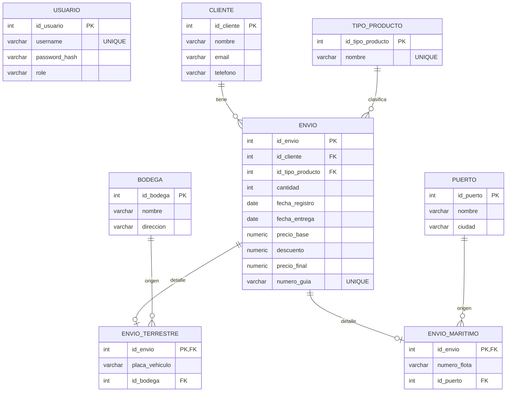

# Diagrama Entidad-Relación (E-R)



## DBML (dbdiagram.io)

> Puedes pegar este bloque en https://dbdiagram.io para generar el diagrama automáticamente.

```dbml
Table usuario {
  id_usuario int [pk, increment]
  username varchar(50) [not null, unique]
  password_hash varchar(255) [not null]
  role varchar(20) [not null, default: 'user']

  Indexes {
    (username)
  }
}

Table cliente {
  id_cliente int [pk, increment]
  nombre varchar(100) [not null]
  email varchar(100)
  telefono varchar(20)

  Indexes {
    (nombre)
  }
}

Table tipo_producto {
  id_tipo_producto int [pk, increment]
  nombre varchar(50) [not null, unique]

  Indexes {
    (nombre)
  }
}

Table bodega {
  id_bodega int [pk, increment]
  nombre varchar(100) [not null]
  direccion varchar(200)

  Indexes {
    (nombre)
  }
}

Table puerto {
  id_puerto int [pk, increment]
  nombre varchar(100) [not null]
  ciudad varchar(100)

  Indexes {
    (nombre)
  }
}

Table envio {
  id_envio int [pk, increment]

  id_cliente int [not null]
  id_tipo_producto int [not null]

  cantidad int [not null, note: 'CHECK (cantidad > 0)']
  fecha_registro date [not null]
  fecha_entrega date [not null]

  precio_base numeric(10,2) [not null, note: 'CHECK (precio_base >= 0)']
  descuento numeric(10,2) [not null]
  precio_final numeric(10,2) [not null, note: 'CHECK (precio_final = precio_base - descuento)']

  numero_guia varchar(10) [not null, unique]

  Indexes {
    (id_cliente)
    (id_tipo_producto)
    (numero_guia)
  }
}

Table envio_terrestre {
  id_envio int [pk]
  placa_vehiculo varchar(6) [not null, note: "CHECK (placa_vehiculo ~ '^[A-Z]{3}[0-9]{3}$')"]
  id_bodega int [not null]

  Indexes {
    (id_bodega)
  }
}

Table envio_maritimo {
  id_envio int [pk]
  numero_flota varchar(8) [not null, note: "CHECK (numero_flota ~ '^[A-Z]{3}[0-9]{4}[A-Z]$')"]
  id_puerto int [not null]

  Indexes {
    (id_puerto)
  }
}

Ref: cliente.id_cliente < envio.id_cliente
Ref: tipo_producto.id_tipo_producto < envio.id_tipo_producto

Ref: bodega.id_bodega < envio_terrestre.id_bodega
Ref: puerto.id_puerto < envio_maritimo.id_puerto

Ref: envio.id_envio - envio_terrestre.id_envio
Ref: envio.id_envio - envio_maritimo.id_envio
```
