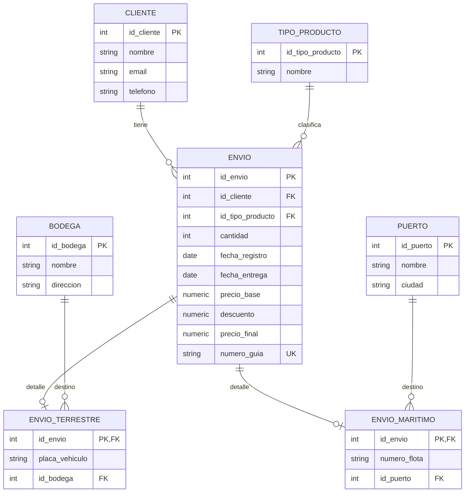

# Diagrama E-R (Mermaid)

> Nota: este diagrama está expresado en Mermaid `erDiagram` para que pueda renderizarse en GitHub/GitLab o en extensiones de VS Code.

## Reglas de negocio (notas)

- Cada envío queda asociado a un cliente.
- Descuento automático si `cantidad > 10`:
  - Terrestre: 5% sobre `precio_base`.
  - Marítimo: 3% sobre `precio_base`.
- Se registra: `precio_base`, `descuento` y `precio_final`.
- Validaciones de formato:
  - `placa_vehiculo`: 3 letras + 3 números (ej: `ABC123`).
  - `numero_flota`: 3 letras + 4 números + 1 letra (ej: `ABC1234Z`).
  - `numero_guia`: alfanumérico único de 10 caracteres.
